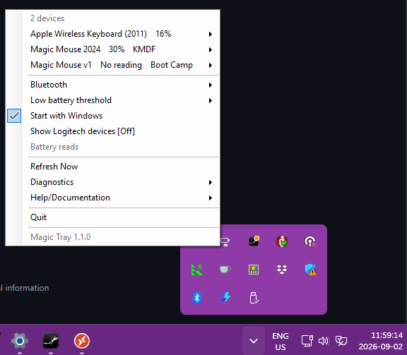

# Magic Tray

**Free Magic Mouse battery and scroll on Windows 10/11.** MIT licensed. No subscription. No trial that kills scroll.

Magic Tray is a Windows tray app for **Apple Magic Mouse** (v1, v2, and **Magic Mouse 2024 / Magic Mouse v3**, PID `0323`), **Magic Keyboard**, and **Magic Trackpad**. It shows battery percent in the tray and can install a scroll driver you confirm. It is a free alternative to [Magic Utilities](https://magicutilities.net/) — not a clone of MU’s proprietary drivers, gestures, trackpad suite, or key remaps.

Released 2 September 2026 · [Download v1.1.0](https://github.com/LesleyMurfin/magic-tray/releases/tag/v1.1.0) · [Site](https://lesleymurfin.github.io/magic-tray/)

If this saved you a paid subscription, **star both repos**: [Magic Tray](https://github.com/LesleyMurfin/magic-tray) and the [v3 Windows driver](https://github.com/LesleyMurfin/magic-mouse-v3-windows-fix). Goal: a publicly signed KMDF so Test Mode goes away — [stars & signing](https://lesleymurfin.github.io/magic-tray/funding.html).




---

## Contents

- [Magic Tray vs Magic Utilities](#magic-tray-vs-magic-utilities)
- [Just want a 2024 Magic Mouse driver?](#just-want-a-2024-magic-mouse-driver)
- [Features](#features)
- [Tray menu (1.1.0)](#tray-menu-110)
- [Supported mice](#supported-mice)
  - [What to pick](#magic-mouse-2024-0323--what-to-pick)
- [Supported keyboards](#supported-keyboards)
- [Supported trackpads](#supported-trackpads)
- [Scroll](#scroll)
  - [Magic Mouse v1 / v2](#magic-mouse-v1--v2-030d-0269)
  - [Magic Mouse 2024 / v3](#magic-mouse-2024--v3-0323)
  - [Test Mode](#test-mode-self-signed-0323-drivers)
- [Why Magic Mouse v3 scroll breaks on Windows](#why-magic-mouse-v3-scroll-breaks-on-windows)
- [Keyboard battery](#keyboard-battery)
- [FAQ](#faq)
- [Building from source](#building-from-source)
- [Diagnostics](#diagnostics)
- [Releases](#releases)
- [License](#license)
- [Which driver](https://lesleymurfin.github.io/magic-tray/drivers.html)
- [Why v3 is hard](https://lesleymurfin.github.io/magic-tray/v3.html)
- [Stars & signing](https://lesleymurfin.github.io/magic-tray/funding.html)
- [llms.txt](llms.txt) (for agents)

---


## Magic Tray vs Magic Utilities

| | Magic Tray (free, MIT) | Magic Utilities (paid) |
|---|---|---|
| Mouse battery in the tray | Yes (Bluetooth + USB HID when Windows exposes it) | Yes |
| Keyboard battery | Yes, after a one-time SDP patch you run | Yes |
| Trackpad battery | Yes. No scroll/gesture driver. | Yes, plus a paid trackpad suite |
| Time-based battery alerts | Yes. Floor 10 → 5 → 1. See [docs/ALERTS.md](docs/ALERTS.md). | Customizable percent alerts |
| Scroll driver (mice) | Yes, user-initiated | Yes, proprietary (mouse + trackpad) |
| Driver signature | v1/v2: catalog-signed Boot Camp. **v3 KMDF / Patched Apple are self-signed** (Test Mode + Memory Integrity off). Not WHQL. | WHQL; works with Secure Boot |
| Gestures, trackpad tap / 3-finger, media-key remaps | **Not shipped** | Yes |
| Subscription / trial that disables scroll | Never | Required after trial |

If you need MU’s gesture or trackpad suite, use Magic Utilities. If you need battery + mouse scroll on Windows without a subscription, use Magic Tray.

---

## Install

1. Download `MagicMouseTray.exe` from [Releases](https://github.com/LesleyMurfin/magic-tray/releases/latest).
2. Run it. No installer. The tray does not need admin.
3. The icon shows battery percent once a supported device is paired.

**Requires:** Windows 10 1809+ (build 17763) or Windows 11, x64.

The same Release attaches the keyboard battery patch (`Install-KeyboardBattery.cmd` + `kbd-patch-cachedservices.ps1`). You only need those if you want keyboard battery. **Pass `-Mac`.** There is no default MAC.

> Windows may show SmartScreen on the first run (unsigned open-source exe). **More info → Run anyway**, or right-click → Properties → **Unblock**.

---

## Just want a 2024 Magic Mouse driver?

You have the USB-C Magic Mouse (sold as **Magic Mouse 2024**, also called **v3**). Windows moves the pointer, but **the wheel does nothing**. That is normal — Windows ships no scroll driver for this mouse.

**What works right now**

Download **Magic Tray** from [Releases](https://github.com/LesleyMurfin/magic-tray/releases/latest) and run it. Battery percent appears as soon as the mouse is paired — no driver, no reboot, no admin. If the wheel is still dead, that is expected: the wheel needs a driver.

**What the wheel needs, honestly**

Scroll on this mouse needs our own **KMDF** driver, and that driver is not Microsoft-signed (not WHQL). Windows will only load it if you put the PC into **Test Mode** and turn **Memory integrity** off — a real security trade-off, plus a permanent desktop watermark. Getting it properly signed so none of that is needed is tracked in [#89](https://github.com/LesleyMurfin/magic-tray/issues/89).

**KMDF is still experimental and you cannot install it from the tray yet.** The driver lives in [magic-mouse-v3-windows-fix](https://github.com/LesleyMurfin/magic-mouse-v3-windows-fix), and the piece Magic Tray needs in order to install it has not reached that repository’s `main` branch — it is still an open pull request ([#5](https://github.com/LesleyMurfin/magic-mouse-v3-windows-fix/pull/5)). Until it lands, choosing **KMDF** in the tray tells you it is unavailable and stops. It will not quietly install something else instead.

So: **battery today, scroll when the driver lands.** Two different things have to happen. The tray can only offer KMDF once the installer entrypoint reaches the driver repo’s `main` branch — that is [magic-mouse-v3-windows-fix#5](https://github.com/LesleyMurfin/magic-mouse-v3-windows-fix/pull/5), and it is what to watch for scroll becoming available at all. Getting rid of Test Mode needs the driver properly signed, which is a separate job tracked in [#89](https://github.com/LesleyMurfin/magic-tray/issues/89).

**The three driver choices for this mouse**

- **KMDF** — the recommended one. Scroll **and** battery together. Self-signed, so it needs [Test Mode](#test-mode-self-signed-0323-drivers). Not installable from the tray yet, as above.
- **Patched Apple** — an old experiment, kept only for the record. Scroll **or** battery, never both at the same time. Also self-signed, so also needs Test Mode. **Do not pick this** unless you specifically want the experiment.
- **Stock Windows** — Windows’ own Bluetooth mouse driver. Pointer only: no scroll. Battery percent usually still reads. No Test Mode, and it removes our driver.

Side-by-side: [what to pick](#magic-mouse-2024-0323--what-to-pick).

**Older Magic Mouse** (Lightning or AA batteries): none of the above applies to you. Pick **Boot Camp** in the tray. It is signed by Apple, so there is no Test Mode and no watermark.

---

## Features

- Battery percent on the tray for Magic mice, keyboards, and trackpads
- Alerts: [docs/ALERTS.md](docs/ALERTS.md) (10 → 5 → 1, plus time warnings)
- Persistent 0–1% warning (replace AA, or plug in USB-C / Lightning)
- Start with Windows
- User-initiated scroll-driver install for **mice** (older mice: Boot Camp; 2024 USB-C: KMDF). Trackpads do not get a scroll driver.
- User-initiated keyboard SDP patch
- Bluetooth menu opens Windows Bluetooth Settings
- Optional Logitech rows (off by default)
- Single self-contained `MagicMouseTray.exe`

**Battery reads** appears only when a Magic Mouse 2024 / v3 is connected **and** the bound driver is KMDF. Hidden otherwise.

Magic Tray does not install a driver until you pick one and confirm UAC. It never swaps drivers behind your back.

---

## Tray menu (1.1.0)

Right-click the tray icon.

| Item | What it does |
|------|-------------|
| *N* devices | Each Magic device: battery %, driver badge, enable, per-device alert |
| Bluetooth | Opens Windows Bluetooth Settings |
| Low battery threshold | 10% / 5% / 1% (default 10%) |
| Start with Windows | Auto-start on login |
| Show Logitech devices [Off] | Experimental. Off by default. |
| Battery reads | Status only. Visible on 2024 / v3 + KMDF. |
| Refresh Now | Immediate battery read |
| Diagnostics | Logs, test notification, capture scripts |
| Help/Documentation | Alerts doc, this repo, report a bug |
| Quit | Exit |

Footer: **Magic Tray 1.1.0**.

---

## Supported mice

Catalog: [`KnownMice`](MagicMouseTray/MouseBatteryDevice.cs) (CI: [`EveryKnownMousePid_HasUsbVid05acRow`](MagicMouseTray.Tests/MouseBatteryDeviceTests.cs)). Reports: [docs/TESTED.md](docs/TESTED.md). PID missing? [Open an issue](https://github.com/LesleyMurfin/magic-tray/issues/new?template=missing-device.md).

| Model | PID | Recommended driver | Scroll | Battery | Tested |
|---|---|---|---|---|---|
| Magic Mouse 2024 (USB-C, **Magic Mouse v3**) | `0x0323` | **KMDF** from [magic-mouse-v3-windows-fix](https://github.com/LesleyMurfin/magic-mouse-v3-windows-fix) | Yes, with [Test Mode](#test-mode-self-signed-0323-drivers) | Yes | [yes — KMDF](docs/TESTED.md) |
| Magic Mouse v1 | `0x030D` | **Boot Camp** [tealtadpole INF](https://github.com/tealtadpole/MagicMouse2DriversWin11x64) | Yes | Yes | [row](docs/TESTED.md) |
| Magic Mouse v2 | `0x0269` | Same Boot Camp INF | Yes | Yes | — |
| Apple Wireless Mouse | `0x0310` | Same Boot Camp INF | Yes | Yes | — |

### Magic Mouse 2024 (`0323`) — what to pick

| Choice in the tray | Wheel | Battery | Test Mode | Who it is for |
|---|---|---|---|---|
| **KMDF** | Yes | Yes | Required | Almost everyone. Recommended, but [not installable from the tray yet](#just-want-a-2024-magic-mouse-driver). |
| Patched Apple | Yes, but only in its scroll mode | Yes, but only in its battery mode | Required | Old experiment. Wheel and battery are mutually exclusive — one or the other, never both. Do not pick this. |
| Stock Windows | No | Often yes | Not needed | Pointer only. Hands the mouse back to Windows and removes our driver. |

---

## Supported keyboards

Catalog: [`KnownKeyboards`](MagicMouseTray/KeyboardBatteryDevice.cs) (CI: [`EveryKeyboardPid_HasUsbVid05acRow`](MagicMouseTray.Tests/KeyboardBatteryDeviceTests.cs)). Bluetooth battery needs the [SDP patch](#keyboard-battery). USB HID battery is read when Windows exposes `VID_05AC` + the same PID.

| Model | PID | Driver | Scroll | Battery | Tested |
|---|---|---|---|---|---|
| Apple Wireless Keyboard (2011, A1314) ANSI / ISO / JIS | `0x0239` / `0x023A` / `0x023B` (`0x0255` / `0x0256` / `0x0257`) | SDP patch (not a kernel driver) | n/a | Yes after patch | [yes — `0x0239`](docs/TESTED.md) |
| Magic Keyboard (A1644) / ISO | `0x024F` / `0x0250` | SDP patch | n/a | Yes after patch | Not hardware-tested here |
| Magic Keyboard with Touch ID (A2449) / ISO | `0x0267` / `0x026C` | SDP patch | n/a | Yes after patch | Not hardware-tested here |
| Magic Keyboard (2021) / Touch ID / Numeric Keypad | `0x029C` / `0x029A` / `0x029F` | SDP patch | n/a | Yes after patch | Not hardware-tested here |
| Magic Keyboard (2024, USB-C) / Touch ID / Numeric Keypad | `0x0320` / `0x0321` / `0x0322` | SDP patch | n/a | Yes after patch | Not hardware-tested here |

---

## Supported trackpads

Battery only: percent, enable, threshold, time alerts. **No** KMDF / Boot Camp radios. **No** Magic Utilities trackpad gestures.

| Model | PID | Driver | Scroll | Battery | Tested |
|---|---|---|---|---|---|
| Magic Trackpad (v1) | `0x030E` | None | n/a | Yes (AA) | — |
| Magic Trackpad 2 | `0x0265` | None | n/a | Yes (Lightning) | — |
| Magic Trackpad 2024 (USB-C) | `0x0324` | None | n/a | Yes (USB-C) | — |

Hardware reports: [docs/TESTED.md](docs/TESTED.md). Missing PID: [open an issue](https://github.com/LesleyMurfin/magic-tray/issues/new?template=missing-device.md).

---

## Scroll

Scroll needs an Apple mouse filter driver **installed and bound**. The tray offers the install after you confirm.

### Magic Mouse v1 / v2 (`030D`, `0269`)

Install the Boot Camp INF from [tealtadpole/MagicMouse2DriversWin11x64](https://github.com/tealtadpole/MagicMouse2DriversWin11x64) (Apple Wireless Mouse folder). Right-click the `.inf` → **Install**, or use the tray. Catalog-signed. **Test Mode is not required.**

### Magic Mouse 2024 / v3 (`0323`)

The tealtadpole Boot Camp INF does **not** cover PID `0323`. Scroll on this mouse needs the separate **KMDF** driver from [LesleyMurfin/magic-mouse-v3-windows-fix](https://github.com/LesleyMurfin/magic-mouse-v3-windows-fix), which is self-signed and therefore needs [Test Mode](#test-mode-self-signed-0323-drivers).

**Availability.** The tray’s KMDF install step does not work yet. The installer entrypoint it looks for is still an open pull request on the driver repo ([#5](https://github.com/LesleyMurfin/magic-mouse-v3-windows-fix/pull/5)) and is not on that repo’s `main` branch. Pick **KMDF** today and the tray reports exactly that, then stops — it never installs a different driver instead, and it never rebinds your mouse silently.

When that entrypoint does land, the tray will take a snapshot of the driver repo’s `main` branch and run the installer after you confirm UAC. That snapshot is the current branch tip rather than a pinned, checksum-verified release, which is a further reason KMDF is labelled experimental. Signing the driver properly — which would also retire Test Mode — is tracked in [#89](https://github.com/LesleyMurfin/magic-tray/issues/89).

**Stock Windows** hands the mouse back to Windows’ own Bluetooth HID driver. The pointer keeps working, the wheel does not, and no Test Mode is needed. Battery percent usually still reads, but Magic Tray’s dedicated **Battery reads** path needs KMDF.

**Patched Apple** is a leftover binary patch of Apple’s old filter driver. It is self-signed too, so it needs the same Test Mode setup as KMDF, and on it scroll and battery are mutually exclusive — you get one or the other, never both. The tray never swaps between these choices on its own: if the driver you picked is missing, it says so and stops.

If the wheel still does nothing after a KMDF install succeeds: Bluetooth settings → remove the mouse → pair it again. Windows sometimes keeps the old binding.

### Test Mode (self-signed 0323 drivers)

Both 0323 driver choices — **KMDF** and **Patched Apple** — are **self-signed**, not WHQL. Windows will not load either of them until Test Mode is on and Memory integrity is off. The “Test Mode” desktop watermark is expected. Magic Utilities’ paid drivers are WHQL and skip all of this; ours cannot yet ([#89](https://github.com/LesleyMurfin/magic-tray/issues/89)).

You do **not** need the F7 “Disable driver signature enforcement” boot.

**Read this before you change anything.** These are real, machine-wide trade-offs:

- **Secure Boot blocks Test Mode.** With Secure Boot on, `bcdedit /set testsigning on` is refused. Turning Secure Boot off in firmware is the only way round it, and some games with anti-cheat and some dual-boot setups stop working afterwards.
- **BitLocker.** Changing boot settings can trigger a BitLocker recovery prompt on the next start. Suspend BitLocker first (Control Panel → **BitLocker Drive Encryption** → Suspend protection) and have your recovery key to hand.
- **Memory integrity off lowers your security** for as long as it stays off, not just while you install.

Do this **before** you pick **KMDF** or **Patched Apple**:

1. Suspend BitLocker and note your recovery key.
2. Elevated Command Prompt: `bcdedit /set testsigning on`
3. Windows Security → Device security → Core isolation → **Memory integrity** = Off
4. Reboot. The “Test Mode” desktop watermark is expected.
5. Now pick the driver in the tray and confirm UAC.

**Putting the PC back to normal.** First switch the mouse to **Stock Windows** (or otherwise remove the self-signed driver) — turning Test Mode off while a self-signed 0323 driver is still bound just kills scroll, because Windows refuses to load it. Then:

1. Elevated Command Prompt: `bcdedit /set testsigning off`
2. Windows Security → Device security → Core isolation → **Memory integrity** = **On**
3. Re-enable Secure Boot in firmware if you turned it off.
4. Reboot so all of that takes effect, then resume BitLocker protection if it is still suspended.

v1/v2 Boot Camp installs skip this section entirely: that INF is catalog-signed by Apple and needs no Test Mode.

---

## Why Magic Mouse v3 scroll breaks on Windows

The 2024 Magic Mouse (v3, USB-C, PID `0323`) is not in Apple’s old Boot Camp INF. On Windows the HID stack can collapse collections (often called Mode A vs Mode B): scroll and battery fight over the same device. Stock Windows often has battery and no scroll; a patched Apple filter can restore scroll and drop battery.

**Research and the KMDF fix live in a separate repo** (this tray repo does not vendor kernel sources):

- [LesleyMurfin/magic-mouse-v3-windows-fix](https://github.com/LesleyMurfin/magic-mouse-v3-windows-fix) — the KMDF driver and the patched Apple path
- [HID research (RID 0x90, collections, DSM)](https://github.com/LesleyMurfin/magic-mouse-v3-windows-fix/blob/main/v1-binary-patch/docs/hid-research.md)
- [Bug analysis (Mode A/B)](https://github.com/LesleyMurfin/magic-mouse-v3-windows-fix/blob/main/v1-binary-patch/docs/bug-analysis.md)
- [Mode A/B diagram](https://github.com/LesleyMurfin/magic-mouse-v3-windows-fix/blob/main/v1-binary-patch/docs/diagrams/diagram-mode-ab.md)

Magic Tray’s recommended path is KMDF from that repo: scroll **and** battery (Input `0x90` on COL02), once its installer entrypoint reaches `main`.

---

## Keyboard battery

Apple wireless keyboards declare battery as Input-only, so Windows cannot poll it. A one-time registry patch of the Bluetooth SDP cache (`HKLM\...\BTHPORT\Parameters\Devices\<MAC>`) exposes battery as a Feature report. No kernel driver.

**You must pass the keyboard MAC.** `kbd-patch-cachedservices.ps1` requires `-Mac` (12 hex digits, colons optional).

Find it in Device Manager → Bluetooth → keyboard → Details → **Bluetooth device address**, or from the tray when it offers the patch.

**From a Release:** keep `Install-KeyboardBattery.cmd` and `kbd-patch-cachedservices.ps1` in the same folder, then elevated:

```bat
Install-KeyboardBattery.cmd -Mac aabbccddeeff
```

Toggle Bluetooth off/on so Windows re-reads the cache.

**From source:**

```powershell
.\scripts\kbd-patch-cachedservices.ps1 -Mac aabbccddeeff
```

Re-pairing the keyboard erases the patch. Until it is applied, the tray shows that the keyboard needs the SDP-cache patch.

---

## FAQ

**Does Magic Mouse 2024 (Magic Mouse v3) work on Windows 11?**  
Battery, yes — Magic Tray 1.1.0 shows the percent with no driver at all. Scroll needs the **KMDF** driver from [magic-mouse-v3-windows-fix](https://github.com/LesleyMurfin/magic-mouse-v3-windows-fix), which is self-signed and so needs [Test Mode](#test-mode-self-signed-0323-drivers) with Memory integrity off — and its tray install step is [not available yet](#just-want-a-2024-magic-mouse-driver). Battery is HID Input `0x90` on COL02.

**Is this Magic Utilities?**  
No. Free MIT. No subscription. No MU binaries. No gesture / trackpad / media-key suite.

**Will scroll stop when a trial expires?**  
No. There is no trial.

**Do trackpads get scroll or tap-to-click?**  
No. Battery and alerts only.

---

## Building from source

Requires the .NET 8 SDK (Windows).

```powershell
dotnet publish -c Release
# Output: bin\Release\net8.0-windows10.0.17763.0\win-x64\publish\MagicMouseTray.exe
```

The exe filename stays `MagicMouseTray.exe`. The product name is **Magic Tray**.

KMDF sources live in [magic-mouse-v3-windows-fix](https://github.com/LesleyMurfin/magic-mouse-v3-windows-fix) (`v2-kmdf-driver/`). This repo does not vendor that driver.

---

## Diagnostics

Log file: `%APPDATA%\MagicMouseTray\debug.log`

| Line | Meaning |
|---|---|
| `OK battery=83%` | Successful read |
| `OPEN_FAILED err=5` | COL01 skipped (Windows holds that handle) |
| `DRIVER_CHECK status=...` | Per-device driver health |
| `TOAST_SENT` | Low-battery notification |
| `CRITICAL_ALERT_SHOWN` | 1% persistent window |

---

## Releases

CI builds on a `v*` tag: test, publish win-x64, optional Authenticode (`SIGN_PFX_*`), then attach `MagicMouseTray.exe`, `kbd-patch-cachedservices.ps1`, `Install-KeyboardBattery.cmd`, `capture-state.ps1`, `diagnose-driver.ps1`, `mm-bt-stack-snapshot.ps1`, and `SHA256SUMS`. `scripts/verify-release.ps1` must pass before the GitHub Release is created.

`FileVersion` / `AssemblyVersion` are `1.1.0.0`.

---

## Credits

The LowerFilter sandwich (app → Windows HID → **filter** → Bluetooth → mouse) is from [sbagirici/apple-magic-mouse-scroll-fix-windows](https://github.com/sbagirici/apple-magic-mouse-scroll-fix-windows). That Architecture diagram is why the v1/v2 scroll path is understandable. **Please star their repo.** We redraw it on [v3.html](https://lesleymurfin.github.io/magic-tray/v3.html#stack). Their installer is for v1/v2 with Apple’s signed `applewirelessmouse.sys`. Magic Mouse 2024 (`0323`) still uses KMDF from [magic-mouse-v3-windows-fix](https://github.com/LesleyMurfin/magic-mouse-v3-windows-fix).

v1/v2 Boot Camp INF packaging: [tealtadpole/MagicMouse2DriversWin11x64](https://github.com/tealtadpole/MagicMouse2DriversWin11x64).

---

## License

[MIT](LICENSE) · Copyright (c) 2026 Lesley Murfin.
